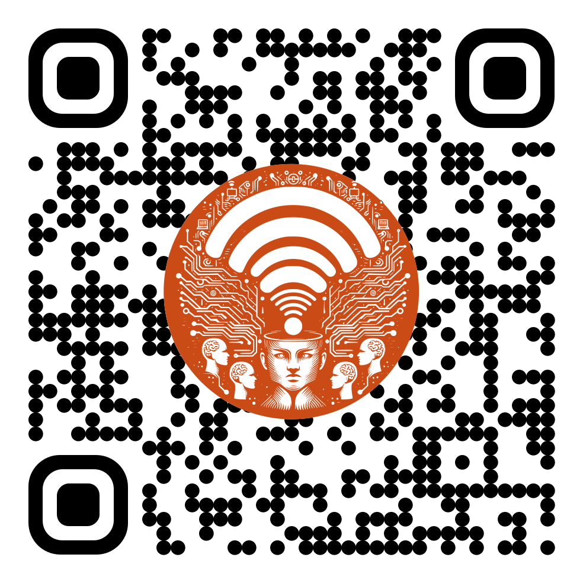

# Ludvíka Podéště 13: dos and don'ts

Do feel at home! If you break some of the rules some of the time maybe that's ok.

First things first, the wifi:

{width=200px height=200px}

## Emergencies

* The gas and water mains are all the way downstairs, in the back room next to the washing machine.
* The electric fuses (CS: pojistky, PL: bezpieczniki) are right behind the entrance door on the left side.
* The wifi router is upstairs, leftmost room when coming up the stairs.
* Option of last resort: call Vít at +48 570 075 993

## Parking

Several options:

* Official parking at the end of the street. Best bet but only five-ish places and often full.
* Parking along the pavement like everyone else does is against the rules, but everyone does it.
* If there's no other place to park, you can find the key to the gate (number 48, I think?) behind the entrance door on the left side. But re-park please, when Vít's back he wants to park there!

## Kitchen

* Do take any food/drink you need, and perhaps consider leaving something else in return. Please don't touch the *fancy loose leaf teas* in the cupboard above the dishwasher.
* Do *eat or throw away* food that's about to expire or *starting to go bad*.
* **Don't** put the following into the dishwasher: crystal glass, cutting knives, wooden spoons/spatulas/etc.
* Do turn the dishwasher on before it gets too smelly. The tablets are either on the counter or in the corner cupboard right of the fridge. The salt does not need refilling. Turn on, use the eco program (the default), press start, close the dishwasher door, and you're all set. It opens automatically when drying.
* When you use the kitchen hood (CS: digestoř, PL: okap), open the window at least a little so it can suck in the air.
* How the oven/microwave work, I don't know either. Press some buttons and pray.
* Clean up after yourself, don't leave the sink full.

## Living room

Yes you're right, that's the same room as the kitchen.

* If you spill anything on the wooden tables or the leather sofa, do wipe it immediately.
* The cotton ball lights on the window are automatic, no need to touch them at all. We have an intelligent home!
